# 🖥️ Sistema Integral de Gestión de Manufactura

Este sistema tiene como objetivo establecer un ecosistema digital mediante la tecnología de Python, permitiendo a los usuarios digitalizar registros y generar reportes de manera eficiente.

Para garantizar la seguridad de la información, se han implementado validaciones que ayudan a prevenir errores al momento de ingresar datos importantes para la empresa.

Además, el sistema integra funcionalidades que permiten almacenar todos los datos en archivos JSON, reduciendo el riesgo de pérdida de información importante.

Su propósito es optimizar el control de procesos, mejorar la organización de la información y facilitar la toma de decisiones dentro del área de manufactura.

## 📋 Tabla de contenidos


- [📖 Descripción General](#-descripción-general)
- [💻 Tecnologías Utilizadas](#-tecnologías-utilizadas)
- [✅ Requisitos para utilizar este sistema](#-requisitos-para-utilizar-este-sistema)
- [⬇️ Instalación del sistema](#️-instalación-del-sistema)
- [📁 Estructura del sistema](#-estructura-del-sistema)
- [🦾 Funcionalidades](#-funcionalidades)
- [🛡️ Validaciones del sistema](#️-validaciones-del-sistema)
- [📷 Capturas de Pantalla ](#-capturas-de-pantalla)
- [📌 Roadmap](#-roadmap)

## 📖 Descripción General

**-> ¿De qué se trata el sistema?**

El sistema se encarga de los registros, generación de reportes y consulta de busqueda.
Aumentando la eficiencia y la productividad de la empresa que lo tenga en uso.

El sistema se encarga de hacer la siguientes operaciones:

**Registros**

    1. Registro de clientes
    2. Registro de proveedores
    3. Registro de transacciones de proveedores
    4. Registro de materia prima
    5. Registro de productos finales
    6. Registor de ventas

**Reportes y consultas**

    1. Reporte y Consulta de clientes
    2. Reporte y Consulta de proveedores
    3. Reporte y Consulta de productos finales
    4. Reporte y consulta de ventas

**-> Público objetivo**

El sistema esta dirigido a la emrpesas manufactureras que desean tener los datos centalizados y llevar el contal de todas la entradas y salidas de productos.

**-> Problema que se solucionan con este programa**

El programa se centraliza en  mejorar el control operativo y eliminar la dependencia de sistemas de gestión de datos independientes (como Excel o registros en papel), consolidando la información de forma segura para facilitar la toma de decisiones. 


## 💻 Tecnologías Utilizadas


- [Python](https://www.python.org/downloads/release/python-3123/) : Utilizado para la programación del sistema
- [Git](https://git-scm.com/) : Utilizado para el historial de versiones
- [GitHub](https://github.com/): Utilizado para el flujo del trabajo

## ✅ Requisitos para utilizar este sistema


-  Tener instalado [python](https://www.python.org/downloads/release/python-3123/) version 3.12.3
- Tener instalado la dependencia **rich**

## ⬇️ Instalación del sistema

> ⚠️ Debes tener instalados los requisitos anteriores

#### Clonar el repositorio
```bash
git clone [https://github.com/tu-usuario/nombre-del-repo.git](https://github.com/tu-usuario/nombre-del-repo.git)
```

#### Entrar al directorio
```bash
cd nombre-del-repo
```

#### Instalar dependencias

```bash
pip install rich
``` 

## 📁 Estructura del sistema

```bash 
scrumproject/
├── data/   # Carpeta donde se almacenan los datos
│   ├── clientes.json
│   ├── materia_prima.json
│   ├── orden_produccion.json
│   ├── productos_finales.json
│   ├── proveedores.json
│   ├── transaccion_proveedores.json
│   └── ventas.json
├── .gitignore
├── agregar_venta.py
├── db.py
├── generar_reportes.py
├── gestion_clientes.py
├── gestion_ordenes.py
├── gestion_materiaprima.py
├── gestion_productosfinales.py
├── gestion_proveedores.py
├── validaciones_utils.py
├── menu.py
├── menu_funcionalidades.py
└── README.md
```

## 🦾 Funcionalidades

### Registros
- **Registro de Clientes**: Permite ingresar datos de empresas clientes (nombre, dirección, teléfono, contacto, email).
- **Registro de Proveedores**: Gestiona proveedores con información similar a clientes.
- **Registro de Transacciones de Proveedores**: Registra compras de materia prima a proveedores, actualizando stock automáticamente.
- **Registro de Materia Prima**: Agrega insumos con detalles como nombre, descripción, proveedor, stock, precio y fechas.
- **Registro de Productos Finales**: Crea productos terminados con precio, stock y fechas de fabricación/vencimiento.
- **Registro de Ventas**: Genera ventas asociando cliente, productos, total y fechas; reduce stock de productos.
- **Cambio de Estado de Venta**: Actualiza el estado de una venta existente (Pendiente, En Proceso, etc.).

### Reportes y Consultas
- **Reporte de Productos Finales**: Lista productos con búsqueda por nombre o fecha de fabricación.
- **Reporte de Clientes**: Muestra lista de clientes con búsqueda y opción para ver historial de compras.
- **Historial de Compras de Cliente**: Detalla las ventas de un cliente específico.
- **Reporte de Ventas**: Lista ventas con búsqueda por cliente, fechas o estado.

### Otras Funcionalidades
- **Operaciones de Base de Datos**: CRUD completo (Crear, Leer, Actualizar, Eliminar) para todos los registros.
- **Búsquedas Avanzadas**: Búsqueda parcial en reportes para filtrar datos.
- **Validaciones de Datos**: Verificación de formatos para fechas, emails, teléfonos, etc.

## 🛡️ Validaciones del sistema

- **Validación de Fechas**: Formato DD-MM-YYYY, con verificación de existencia.
- **Validación de Emails**: Patrón estándar de correo electrónico.
- **Validación de Teléfonos**: Exactamente 8 dígitos.
- **Campos Obligatorios**: No permite campos vacíos en registros.
- **Validación Numérica**: Precios, stocks y cantidades deben ser números positivos.
- **Validación de Existencia**: Verifica que proveedores, clientes y productos existan antes de asociarlos.

## 📷 Capturas de Pantalla 

<table>
  <tr>
    <td align="center">
      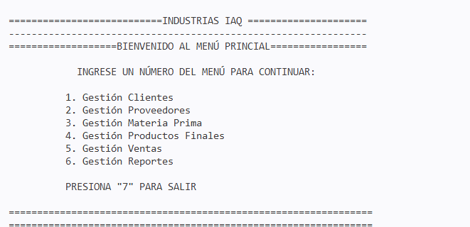<br>
      Menu principal
    </td>
    <td align="center">
      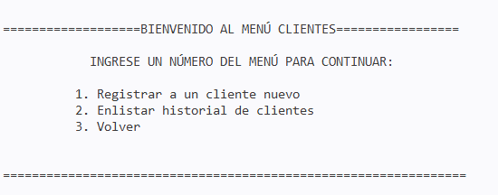<br>
      Menu de Clientes
    </td>
    <td align="center">
      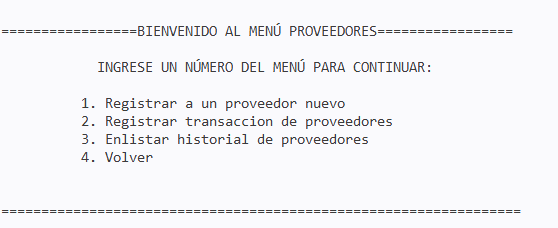<br>
      Menu de Proveedores
    </td>
  </tr>
  <tr>
  <td align="center">
      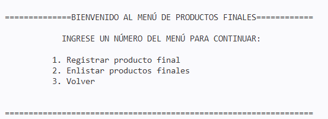<br>
      Menu de Productos Finales
    </td>
    <td align="center">
      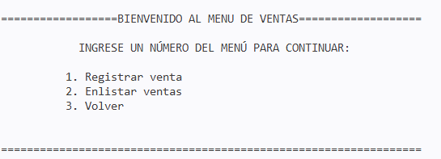<br>
      Menu de Ventas
    </td>
    <td align="center">
      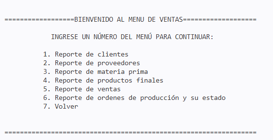<br>
      Menu de Reportes
    </td>
    <tr>
     <td align="center">
      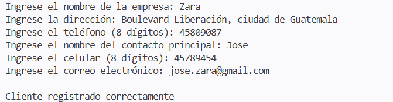<br>
      Registro de clientes
    </td>
    <td align="center">
      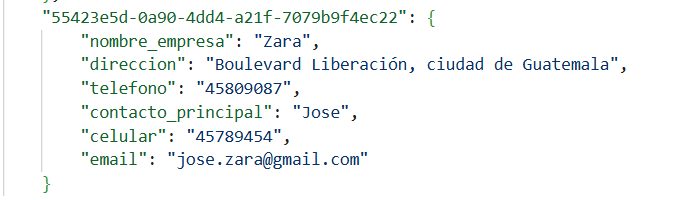<br>
      Cliente registrado en json
    </td>
    <td align="center">
      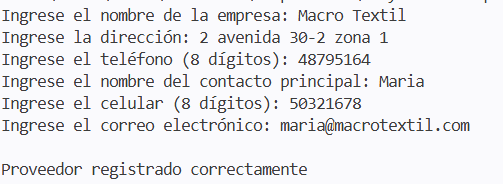<br>
      Registro de proveedores
    </td>
  </tr>
  <tr>
    <td align="center">
      <br>
      Proveedores registrados
    </td>
    <td align="center">
      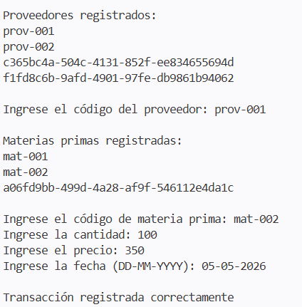<br>
      Registro transacción proveedores
    </td>
    <td align="center">
      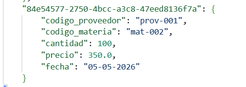<br>
      Transacciones proveedores registradas
    </td>
  </tr>
  <tr>
    <td align="center">
      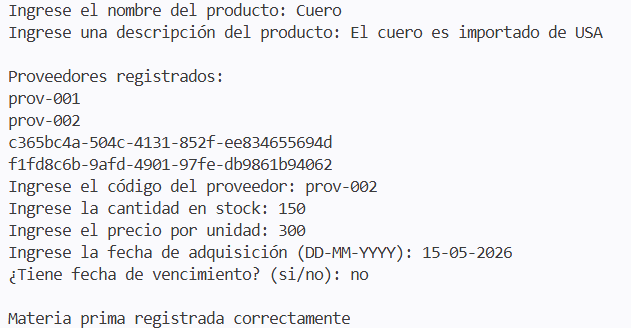<br>
      Registro materia prima
    </td>
    <td align="center">
      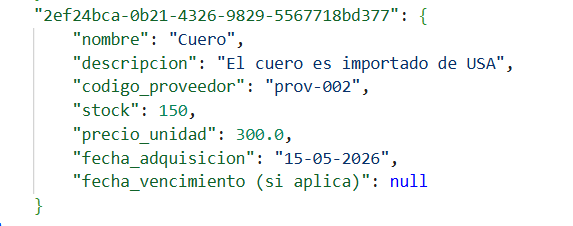<br>
      Materia prima registrada
    </td>
    <td align="center">
      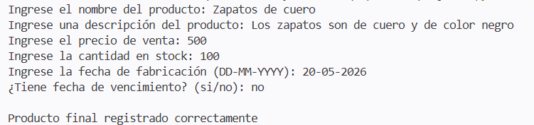<br>
      Registro de producto final
    </td>
  </tr>
  <tr>
    <td align="center">
      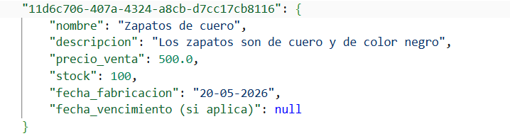<br>
      Producto final registrado
    </td>
    <td align="center">
      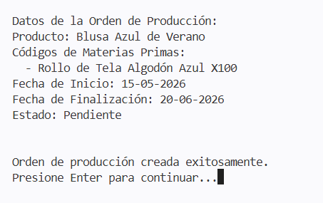<br>
      Registro orden de producción
    </td>
    <td align="center">
      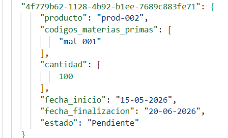<br>
      Orden de producción registrada
    </td>
  </tr>
  <tr>
    <td align="center">
      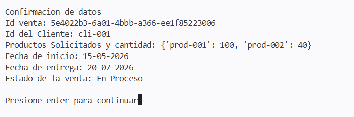<br>
      Registro venta
    </td>
    <td align="center">
      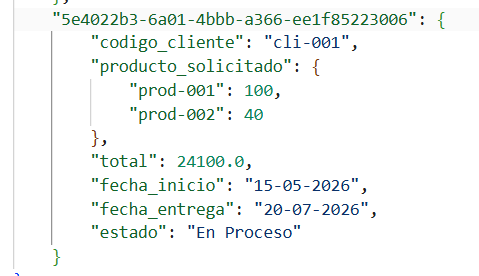<br>
      Venta registada
    </td>
    <td align="center">
      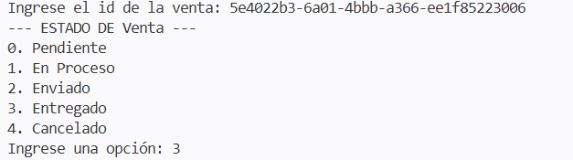<br>
      Registro cambio de estado venta
    </td>
  </tr>
  <tr>
    <td align="center">
      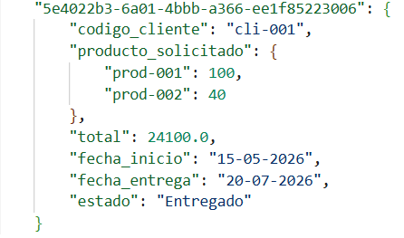<br>
      Cambio de estado venta registrada
    </td>
  </tr>
</table>

## 📌 Roadmap

- Implementar interfaz gráfica (GUI) con Tkinter o similar.
- Agregar autenticación de usuarios.
- Generar reportes en PDF.
- Implementar notificaciones por email.

## 👥 Autores

**Stefanny Estevez**
[Github](https://github.com/StefannyEstevezSolares/)

**Randohl Estuardo Tecún**
[Github](https://github.com/Randolh/)

**Alan Gómez** 
[Github](https://github.com/AlanGomez-Programmer/)


